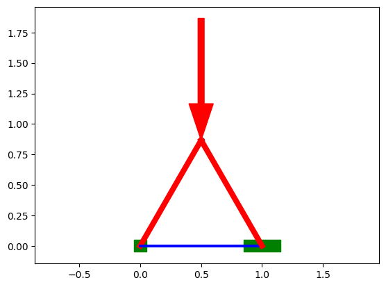
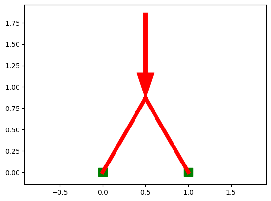
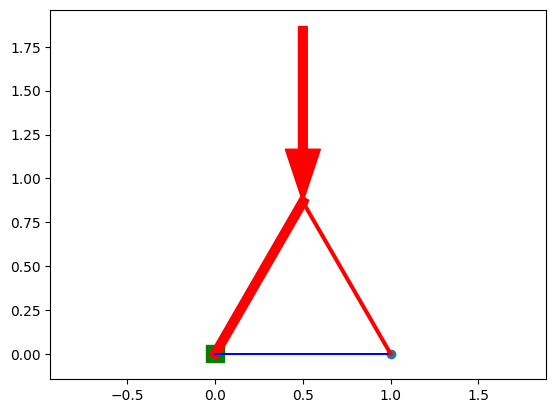
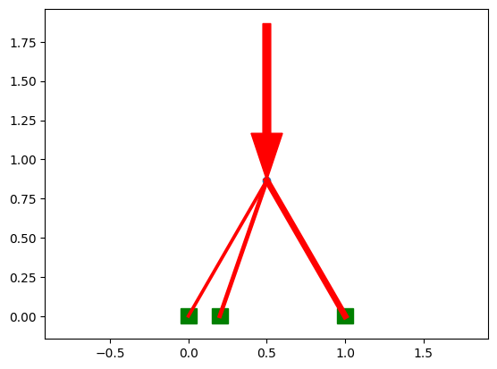

# Torch Bridge: Optimizing Bridge trusses using Pytorch


You can use Pytorch for more than just Neural Networks - its autograd is super powerful for any problem where you need gradients! In this case, optimizing the design of a bridge truss.

## Datastructures
The truss is stored as a graph where each node is a connection point,
and each edge is a beam connecting two nodes. 

Nodes stored as `Nx2 np array of (x,y) coords`

Beams stored as `[(node1_idx, node2_idx)]

Loads: An arbitrary number of loads can be added. Each one is a 2d vector force acting on a node.

Stored as `[(node_index, x_load, y_load),]`

Anchors: Certain nodes should be fixed in one or more axis, taking up any needed force. 
For now I'm skipping this and will just put equal and opposite loads on the bottom of the truss.
TODO: how do I need to access this data later?

Forces: for each edge, I need to store a force acting in the edge. Positive = compression, negative = tension.
That force applies equal and opposite to the two attached nodes, split among x,y components.
stored as Mx1 vector of forces.

## Force calculation algorithm
Calculating all forces throughout the truss is done by solving a system of equations such that each node
reaches equilibrium. 
For each node: the x and y components of all incoming force vectors exactly matches the load:

Take a equilateral triangle with a load of 10 applied downward at the top, and 5 applied up at each bottom

```
    A
  1   2
B   3   C
```

(A positive force is upward or rightward. Angles are relative to the horizontal)

Equations:

```
Ax: F1*cos(th_ba) + F2*cos(th_ca) + 0             == -load_Ax (==0)
Ay: F1*sin(th_ba) + F2*sin(th_ca) + 0             == -load_Ay (==-10)
Bx: F1*cos(th_ab) + F2*0          + F3*cos(th_cb) == -load_Bx (==0)
By: F1*sin(th_ab) + F2*0          + F3*sin(th_cb) == -load_By (==5)
Cx: F1*0          + F2*cos(th_ac) + F3*cos(th_bc) == -load_Cx (==0)
Cy: F1*0          + F2*sin(th_ac) + F3*sin(th_bc) == -load_Cy (==5)
```

This can be written in matrix form as:

```
cos(th_ba), cos(th_ca), 0                     -load_Ax (==0)
sin(th_ba), sin(th_ca), 0              F1     -load_Ay (==-10)
cos(th_ab), 0         , cos(th_cb)  @  F2  == -load_Bx (==0)
sin(th_ab), 0         , sin(th_cb)     F3     -load_By (==5)
0         , cos(th_ac), cos(th_bc)            -load_Cx (==0)
0         , sin(th_ac), sin(th_bc)

A @ F = L
```

Where F is a vector of the forces in each beam, 
A is a matrix constructed from the x,y force equations for each node,
and L is a vector of Loads.
NOTE: careful about the angles theta: each is defined as the angle to the 
horizontal from the incoming node to the current node.

This can now be solved with np.linalg.lsqr.

NOTE: trusses can be over or underdefined. More on that later.

### Constructing the matrix A
It should be 2N rows (x,y for each node) and M columns (one for each beam).

```
Initialize to zeros 2NxM.
For each edge:
    edge_i, n1_i, n2_i == edge index, node1 index, node 2 index
    A[n1_i * 2    ][edge_i] = cos(theta n2 -> n1)
    A[n1_i * 2 + 1][edge_i] = sin(theta n2 -> n1)
    A[n1_2 * 2    ][edge_i] = cos(theta n1 -> n2)
    A[n1_2 * 2 + 1][edge_i] = sin(theta n1 -> n2)
```

NOTE: those cos/sin(theta) will be simplified to the X/Y component: e.g.
`cos(theta) == dx/sqrt(dx^2 + dy^2)`

### Handling Anchor Points
An anchor point is one where any resultant force is allowed,
because it is supplied by the anchor to the ground. A full anchor
allows both X and Y forces to be non-zero, and you can also have a
partial anchor in just one dimension.





Note: having more than one full anchor will make the system over-determined.

In order to account for this, nodes that are full anchors can simply
be removed from the system of equations! A partial X or Y anchor can
just have one of its two lines removed from the system.

### Underconstrained systems
If the system is underconstrained, that means there will be some
nodes that cannot reach equilibrium and will have a net force.
Luckily, that is detected by the `lstsq` call, which will have a
high residual! This should return an error.



### Overconstrained systems

In an overconstrained system, there are many possible solutions of how force 
could be distributed among the beams. In reality, force would be distributed based on the stiffness and displacement of each beam. See [this link](https://josecarlosbellido.files.wordpress.com/2016/04/aranda-bellido-optruss.pdf) for an example of solving this system more exactly.

Here, I'm simply letting the `Least Squares` solver minimize the L2 norm of the forces, which produces a decent result.



## Truss Optimization
What is the "Loss Function" for a truss?

- Optimize strength for a given weight?
- Minimize weight for a given strength?
- Strength / weight ratio?

Typically this is a constrained optimization problem, but using pytorch,
there is no easy way to add a precise constraint. Instead, I could do a 
"relaxed constraint" where there is simply a heavy penalty for going above
the given constraint.

As written, I can provide a force, and calculate the needed "weight" based on 
the forces in each beam.

### Weight of beam, given force

Tensile strength remains constant with length, because there is no risk 
of "bending". Compression however, the same thickness beam gets weaker the 
longer it is.

Tension: `weight = length * force / tensile_strength`

Compression: `weight = length * force / compression_strength(length)`

`tensile_strength = 1`

`compression_strength = 3 / (length + 3)`

Compression: `weight = length * force * (length + 3) / 3` 

# TODO

[x] basic class
[x] add and render loads
[x] store and render forces
[x] force solve
[x] handle anchor points
    [x] render
    [x] remove from matrix equation
    [x] write test
    [x] print / output forces at anchors
[x] think about over and under specified graphs? check residuals?
[x] optimize!
    [x] write "loss" focuntion
    [x] convert variables into tensors
    [x] switch to torch.lstqr
    [x] torch lstsq is giving different outputs???
    [x] freeze node locations that are anchors or loads
    [x] fix draw
    [x] fix tests
    [x] fix
    [x] create functions / scripts
[ ] improve
    [x] try different optimization? - momentum is bad
    [ ] gradient clipping? handling nodes too close?
    [ ] delete members that go to zero force?
    [ ] "regularization" to keep nodes far from each other?