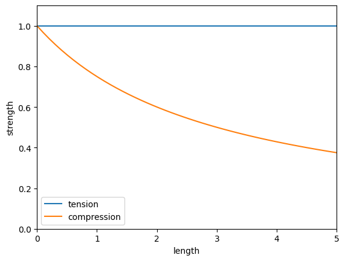

# Torch Bridge: Optimizing Bridge trusses using Pytorch Autograd


You can use Pytorch for more than just Neural Networks - its autograd is super powerful for any problem where you need gradients!

This notebook first creates a Truss object, then constructs and solves a system of equations to find the force in each edge that balances each node. Finally, we sum up the "cost" of each of those edges, taking into account that compression strength goes down for longer distances.

Because we can write out in closed form the "cost" of a truss, we can use autograd to calculate its gradients,
then use an optimizer to move the nodes and lower the cost!

## Representing the Truss
The truss is stored as a list of node `X,Y` coordinates, each of which is stored as a separate `torch.Tensor` so that some of their gradients can be frozen. Each edge is stored as a pair of node indexes.

Loads: An arbitrary number of loads can be added. Each one is a 2d vector force acting on a node. Stored as `[(node_index, x_load, y_load),]` and shown with green arrows.

Anchors: Certain nodes are fixed in one or more axis, taking up any needed force. Stored as `[(node_index, x_set, y_set),]` and shown with green boxes.

Forces: for each edge, I need to store a force acting in the edge. `Positive = compression, negative = tension`.
That force applies equal and opposite to the two attached nodes, split among x,y components.

## Force calculation algorithm
Calculating all forces throughout the truss is done by solving a system of equations such that each node
reaches equilibrium. 
For each node: the x and y components of all incoming force vectors exactly matches the load:

Take a equilateral triangle with a load of 10 applied downward at the top, and 5 applied up at each bottom

```
    A
   / \
  F1  F2
 /     \
B---F3--C
```

(A positive force is upward or rightward. Angles are relative to the horizontal)

Each node creates two equations, one for its X and one for its Y equilibrium:

```
Ax: F1*cos(th_ba) + F2*cos(th_ca) + 0             == -load_Ax (==0)
Ay: F1*sin(th_ba) + F2*sin(th_ca) + 0             == -load_Ay (==-10)
Bx: F1*cos(th_ab) + F2*0          + F3*cos(th_cb) == -load_Bx (==0)
By: F1*sin(th_ab) + F2*0          + F3*sin(th_cb) == -load_By (==5)
Cx: F1*0          + F2*cos(th_ac) + F3*cos(th_bc) == -load_Cx (==0)
Cy: F1*0          + F2*sin(th_ac) + F3*sin(th_bc) == -load_Cy (==5)
```

This can be written in matrix form as:

```
cos(th_ba), cos(th_ca), 0                     -load_Ax (==0)
sin(th_ba), sin(th_ca), 0              F1     -load_Ay (==-10)
cos(th_ab), 0         , cos(th_cb)  @  F2  == -load_Bx (==0)
sin(th_ab), 0         , sin(th_cb)     F3     -load_By (==5)
0         , cos(th_ac), cos(th_bc)            -load_Cx (==0)
0         , sin(th_ac), sin(th_bc)

A @ F = L
```

Where F is a vector of the forces in each beam, 
A is a matrix constructed from the x,y force equations for each node,
and L is a vector of Loads. A will be `2N x M` (x,y for each node) and M columns (one for each beam).

NOTE: those cos/sin(theta) will be simplified to the X/Y component: e.g.
`cos(theta) == dx/sqrt(dx^2 + dy^2)`

### What about Anchor Points?
At an anchor point, any resultant force is allowed, because it is supplied by the anchor to the ground. 
A full anchor allows both X and Y forces to be non-zero, and a
partial anchor allows a resulant force in just one dimension.


Notice that the triangle with two full anchors does not need any tension in the bottom beam.

In order to account for anchor points, their nodes can simply
be removed from the system of equations! A partial X or Y anchor can
just have one of its two lines removed from the system.

### Solving the Equation

Now we need to solve `A @ F = L` for our force vector F with `torch.linalg.lstsq`! 

But will there always be a solution?

#### Underconstrained 
If the system is underconstrained (Imagine a floating node with just a single edge), that means there will be some
nodes that cannot reach equilibrium and will have a net force.
Luckily, that is detected by the `lstsq` call, which will have a
high residual! This will raise a `ValueError` when solving.


### Overconstrained systems

In an overconstrained system, there are many possible solutions of how force 
could be distributed among the beams. In reality, force would be distributed based on the stiffness and displacement of each beam. See [this link](https://josecarlosbellido.files.wordpress.com/2016/04/aranda-bellido-optruss.pdf) for an example of solving this system more exactly.

Here, I'm simply letting the `Least Squares` solver minimize the L2 norm of the forces, which produces a decent result balancing the force between all the possible beams.


## Optimizing the Truss

Here's where the whole point of using `pytorch` comes in! Now that we've solved the force in each beam of the truss, we can calculate a total cost aka "loss" ;) and then move the nodes based on their gradient with respect to the total cost.

Tensile strength remains constant with length, but Compression strength gets weaker for longer beams because they risk bending and buckling. 

Tension: `cost = length * force / tensile_strength`

Compression: `cost = length * force / compression_strength(length)`

We can set `tensile_strength = 1` and use an approximation `compression_strength = 3 / (length + 3)` to get:

Compression: `cost = length * force * (length + 3) / 3` 



Now we can sum up the costs of all the beams in compression and tension, backprop the gradients, and adjust the truss nodes' positions:

```
cost = self.get_cost()
optimizer.zero_grad()
cost.backward()
optimizer.step()  # parameters are all of the non-frozen node position tensors
```

# Future work

Assigning forces: The biggest problem with this system is that using `lstsq` to assign forces minimizes the L2 norm of the forces when there are multiple possible solutions, which isn't actually the "cheapest" possible solution! In theory, the cheapest truss could contain several very high forces, and many very small forces (imagine the pillars of a supension bridge.) More solving / assigning forces while remaining differentiable seems tricky.

Dynamically change nodes and topology: It would be interesting to let the optimization dynamically add and remove nodes and edges in addition to just moving the nodes! I could imagine deleting any edges/nodes where the force goes to zero, and adding new nodes in the middle of high-force beams! It would also be fun to randomly initialize a truss and watch what it develops into.

# TODOs

- [x] basic class
- [x] add and render loads
- [x] store and render forces
- [x] force solve
- [x] handle anchor points
    - [x] render
    - [x] remove from matrix equation
    - [x] write test
    - [x] print / output forces at anchors
- [x] think about over and under specified graphs? check residuals?
- [x] optimize!
    - [x] write "loss" focuntion
    - [x] convert variables into tensors
    - [x] switch to torch.lstqr
    - [x] torch lstsq is giving different outputs???
    - [x] freeze node locations that are anchors or loads
    - [x] fix draw
    - [x] fix tests
    - [x] fix
    - [x] create functions / scripts
- [ ] improve
    - [x] try different optimization? - momentum is bad
    - [ ] gradient clipping? handling nodes too close?
    - [ ] delete members that go to zero force?
    - [ ] "regularization" to keep nodes far from each other?